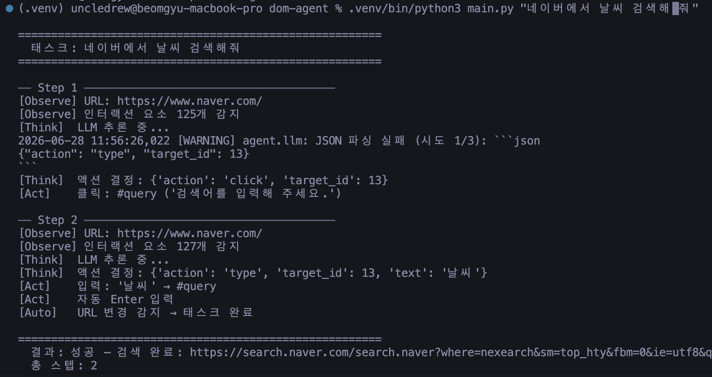
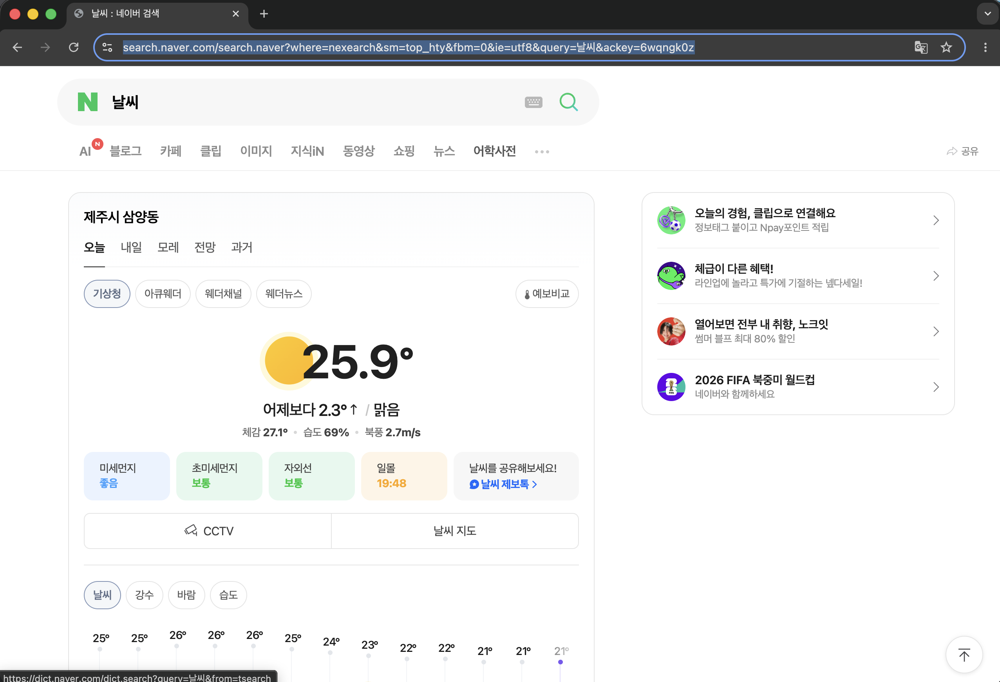
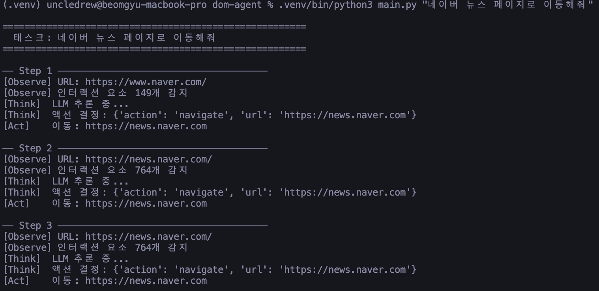
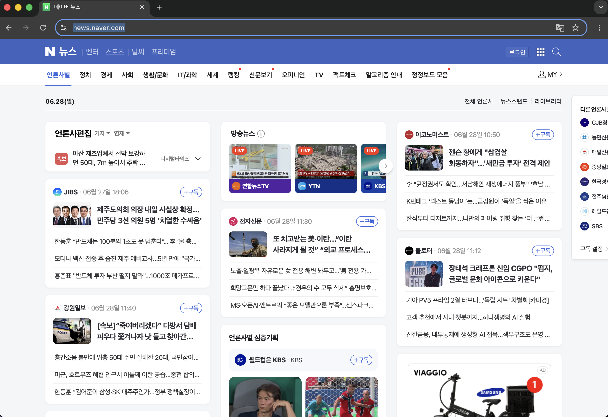

# sLLM 기반 HTML DOM 트리 파싱 웹 오토메이션 에이전트

> **Vision(이미지) 없이 HTML DOM 텍스트만으로 웹을 자율 조작하는 경량 AI 에이전트**  
> MacBook Pro 14 단일 온디바이스 · 클라우드 API 없음 · 원본 HTML 대비 토큰 **98% 절감**

---

## 목차

- [소개](#소개)
- [데모](#데모)
- [시스템 아키텍처](#시스템-아키텍처)
- [기술 스택](#기술-스택)
- [핵심 구현](#핵심-구현)
- [프로젝트 구조](#프로젝트-구조)
- [설치 및 실행](#설치-및-실행)
- [한계 및 개선 방향](#한계-및-개선-방향)

---

## 소개

기존 VLM(Vision Language Model) 기반 GUI 에이전트는 매 스텝마다 화면 전체 스크린샷을 대형 비전 모델에 전달하므로 **수십 GB의 VRAM**과 **스텝당 2~5초의 추론 지연**, 누적되는 API 비용을 요구합니다.

본 프로젝트는 이 문제를 근본적으로 다른 관점에서 접근합니다.

> 웹 브라우저는 이미 화면에 렌더링된 모든 정보를 **HTML DOM이라는 구조화된 텍스트**로 보유하고 있습니다.  
> 버튼의 역할, 링크의 목적지, 입력창의 용도는 `<button>`, `<a>`, `<input>` 태그와 그 속성값 안에 명확히 기술되어 있습니다.

비전 처리 레이어를 완전히 제거하고, HTML DOM 트리를 텍스트로 파싱하여 로컬 소형 언어 모델 **Gemma-2-2B**와 연동하는 경량 웹 오토메이션 에이전트를 구현합니다.

### 핵심 수치

| 지표 | 값 |
|---|---|
| 컨텍스트 토큰 절감률 | **~98%** (원본 HTML 300KB → condensed_text 6KB) |
| 모델 메모리 점유 | **< 2GB** (Gemma-2-2B INT4 양자화) |
| 날씨 검색 태스크 완료 스텝 | **2스텝** |
| 클라우드 의존성 | **없음** (완전 온디바이스) |

---

## 데모

### 시나리오 1 — "네이버에서 날씨 검색해줘"

**터미널 실행 로그**



에이전트가 `ReAct` 루프에 진입하여 총 **2스텝**만에 태스크를 완료합니다.

- **Step 1** — 네이버 메인 DOM 파싱 (인터랙션 요소 125개 감지) → 검색 입력창 클릭
  - 모델이 JSON을 코드블록으로 감싼 형태로 응답했으나, 3단계 fallback 파싱으로 정상 복구
- **Step 2** — 검색창에 `날씨` 입력 → 자동 Enter 실행 → URL 변경 감지로 태스크 완료 선언

**브라우저 실행 결과**



에이전트 종료 시점의 브라우저에 **제주시 삼양동 기준 날씨 정보**가 자동으로 표시됩니다. 현재 기온 25.9°C, 맑음, 습도 69%, 북풍 2.7m/s 등 상세 정보가 렌더링된 상태로, 사람이 직접 검색한 것과 완전히 동일한 결과입니다.

---

### 시나리오 2 — "네이버 뉴스 페이지로 이동해줘"

**터미널 실행 로그**



- **Step 1** — 네이버 메인 DOM에서 뉴스 링크를 감지 → `navigate: https://news.naver.com` 결정 및 실행
- **Step 2, 3** — 뉴스 페이지 도달 후 인터랙션 요소가 764개로 급증하면서, 6,000자 상한으로 잘린 `condensed_text`가 "이미 도착했다"는 상태를 모델이 스스로 판단하지 못하는 한계 노출 → 동일 navigate 액션 반복

> 이는 **T-01(소형 모델 추론 정확도 한계)** 과 **O-01(무한 루프 진입)** 위험이 실제로 발현된 사례입니다.  
> 목적지 도달 자체는 Step 1에서 이미 완전히 성공했으며, 이후 루프는 `done` 판단 실패에 의한 것입니다.

**브라우저 실행 결과**



반복 루프와 무관하게, 브라우저에는 네이버 뉴스 메인 페이지가 정상적으로 렌더링됩니다. 언론사별·정치·경제·사회·IT/과학 등 카테고리 탭과 실시간 기사 목록이 모두 로드된 상태입니다.

---

### 두 시나리오 비교

| 구분 | 날씨 검색 | 뉴스 페이지 이동 |
|---|---|---|
| 태스크 유형 | 검색형 (입력 → 제출) | 내비게이션형 (URL 이동) |
| 완료 신호 | `type` 후 URL 변경 감지 (명확) | 현재 URL 인식 후 `done` 판단 (모호) |
| 스텝 수 | **2스텝** 완료 | 목적지 도달 후 루프 지속 |
| 결과 | 성공 | 브라우저 도달 성공, `done` 판단 실패 |

---

## 시스템 아키텍처

```
사용자 명령 ("네이버에서 날씨 검색해줘")
        │
        ▼
┌───────────────────────────────────────────┐
│              ReAct 에이전트 루프            │
│                                           │
│  ① Observe   Playwright → raw HTML 수집   │
│      │       JS로 data-agent-id 주입       │
│      ▼                                    │
│  ② Think     BeautifulSoup DOM 경량화     │
│      │       noise 제거 + ID 매핑          │
│      │       condensed_text → Gemma-2-2B  │
│      ▼                                    │
│  ③ Act       JSON 액션 파싱               │
│              Playwright 실행              │
│              (click / type / press …)     │
└───────────────────────────────────────────┘
        │
        ▼
   태스크 완료 (URL 변경 감지 또는 done 액션)
```

### DOM 경량화 파이프라인

전체 HTML(~300KB)을 소형 모델이 처리 가능한 크기(~6KB)로 압축합니다.

```
원본 HTML (~300KB)
  → script / style / svg / 숨겨진 요소 제거      ← 50~70% 절감
  → <a>, <button>, <input>, <select>, <textarea> 추출
  → data-agent-id 부여 (JS 주입 방식)
  → condensed_text 생성 (~6KB, 약 98% 절감)
```

**condensed_text 출력 예시:**
```
=== 상호작용 가능한 요소 ===
[ID: 13] <input> [TYPEABLE] 검색어를 입력해 주세요 | type=text name=query
[ID: 14] <button> 검색
[ID: 15] <a> 뉴스 | href=/news

=== 페이지 주요 텍스트 ===
<title> NAVER
<h2> 연합뉴스
```

### JSON 액션 포맷

Gemma-2-2B는 항상 아래 포맷의 JSON을 출력합니다:

```json
{"action": "type",     "target_id": 13, "text": "날씨"}
{"action": "click",    "target_id": 14}
{"action": "press",    "key": "Enter"}
{"action": "navigate", "url": "https://news.naver.com"}
{"action": "done",     "message": "태스크 완료"}
{"action": "fail",     "message": "수행 불가"}
```

---

## 기술 스택

| 분류 | 기술 | 버전 | 역할 |
|---|---|---|---|
| **언어** | Python | 3.10+ | 전체 구현 |
| **브라우저 제어** | Playwright | 1.60+ | 동적 웹 페이지 제어 |
| **DOM 파싱** | BeautifulSoup4 | 4.15+ | HTML 경량화 및 요소 추출 |
| **HTML 파서** | lxml | 6.1+ | 고속 HTML 파싱 엔진 |
| **LLM 런타임** | Ollama | 최신 | 로컬 모델 서빙 |
| **LLM 모델** | Gemma-2-2B | 2B params | 웹 액션 추론 (INT4 양자화) |
| **HTTP 클라이언트** | httpx | 0.28+ | Ollama API 비동기 통신 |
| **하드웨어** | Apple Silicon (M-series) | MacBook Pro 14 | 온디바이스 추론 |

---

## 핵심 구현

### JS 주입 기반 ID 동기화

DOM 파싱 기반 에이전트에서 가장 까다로운 문제는 파서가 텍스트에서 부여한 요소 번호를 실제 브라우저 DOM의 클릭/입력 대상과 정확히 일치시키는 것입니다.

`browser.py`의 `get_html()` 메서드는 HTML을 반환하기 전에 JavaScript를 주입하여 브라우저 DOM 내 인터랙션 태그들을 순서대로 순회하면서 `data-agent-id` 속성을 부여합니다. `dom_parser.py`는 이 속성 값을 그대로 읽어 ID로 사용하므로 파서가 부여하는 `[ID: N]`과 JS가 주입한 `data-agent-id`가 항상 일치합니다.

CSS 셀렉터 생성 우선순위: `id 속성` > `name 속성` > `data-agent-id 속성`

### 소형 모델 한계 보완 전략

| 한계 | 보완 전략 |
|---|---|
| `<a>` 링크를 입력창으로 오인 | `type` 대상이 `<input>`/`<textarea>`가 아니면 자동 교정 |
| 입력 후 Enter를 스스로 안 누름 | `type` 액션 직후 에이전트가 자동으로 `Enter` 실행 |
| `done` 액션 선택 불안정 | URL 변경 감지 시 에이전트가 직접 완료 처리 |
| JSON 포맷 미준수 | 3단계 fallback 파싱 + 최대 3회 재시도 |

---

## 프로젝트 구조

```
dom-agent/
├── agent/
│   ├── __init__.py
│   ├── browser.py        # Playwright 브라우저 제어 모듈
│   ├── dom_parser.py     # BeautifulSoup DOM 경량화 + ID 부여
│   ├── llm.py            # Ollama API 연동 + JSON 출력 강제
│   └── agent.py          # ReAct 메인 에이전트 루프
├── tests/
│   ├── test_step1_browser.py
│   ├── test_step2_dom.py
│   └── test_step3_llm.py
├── output/
│   └── risk_management.md
├── logs/                 # 스크린샷 저장
├── main.py               # 실행 진입점
├── requirements.txt
└── README.md
```

---

## 설치 및 실행

### 1. 사전 요구사항

- Python 3.10 이상
- [Ollama](https://ollama.com) 설치 후 실행

```bash
# Ollama 설치 후 모델 다운로드
ollama pull gemma2:2b
```

### 2. 프로젝트 설정

```bash
# 저장소 클론
git clone <repository-url>
cd dom-agent

# 가상환경 생성 및 의존성 설치
python3 -m venv .venv
source .venv/bin/activate
pip install -r requirements.txt

# Playwright 브라우저 설치
playwright install chromium
```

### 3. 실행

```bash
# Ollama 서버 실행 (별도 터미널)
ollama serve

# 에이전트 실행
.venv/bin/python3 main.py "네이버에서 날씨 검색해줘"
.venv/bin/python3 main.py "네이버 뉴스 페이지로 이동해줘"
```

---

## 한계 및 개선 방향

### 현재 한계

**검색형 태스크**는 `type` 액션 이후 URL 변경이라는 명확한 완료 신호가 있어 안정적으로 동작합니다. 반면 **내비게이션형 태스크**는 목적지 도달 후 "이미 도착했다"는 상태를 모델이 스스로 판단하지 못하는 한계가 있습니다.

| 위험 | 등급 | 현재 상태 |
|---|---|---|
| 소형 모델 추론 정확도 한계 (T-01) | HIGH | 규칙 기반 후처리로 완화 |
| DOM 구조 변경에 따른 셀렉터 불일치 (T-02) | HIGH | JS 주입 ID 동기화로 완화, Shadow DOM은 미지원 |
| 무한 루프 진입 (O-01) | MEDIUM | 최대 15스텝 강제 종료로 완화 |
| 컨텍스트 길이 초과 (T-04) | MEDIUM | 6,000자 상한 적용 (뉴스 페이지 764개 요소 사례 발생) |

### 개선 방향

- `navigate` 액션 이후 현재 URL을 사용자 프롬프트에 명시적으로 포함하여 `done` 판단 정확도 향상
- 더 큰 컨텍스트 창을 가진 모델(Gemma-2-9B, Qwen-2-7B 등)과의 성능 비교 실험
- `condensed_text` 포맷 개선 및 소형 모델 파인튜닝 데이터셋 구축 파이프라인으로 발전

---

## 개발 환경

- **OS:** macOS
- **하드웨어:** MacBook Pro 14 (Apple Silicon)
- **메모리 점유:** Gemma-2-2B INT4 기준 약 2GB 미만

---

## 참고문헌

- Yao et al. (2022). *ReAct: Synergizing Reasoning and Acting in Language Models.* arXiv:2210.03629
- Deng et al. (2023). *Mind2Web: Towards a Generalist Agent for the Web.* NeurIPS 2023
- Zhou et al. (2024). *WebArena: A Realistic Web Environment for Building Autonomous Agents.* ICLR 2024
- Google DeepMind (2024). *Gemma 2: Improving Open Language Models at a Practical Size.* arXiv:2408.00118
- [Ollama](https://ollama.com) · [Playwright](https://playwright.dev) · [Beautiful Soup](https://www.crummy.com/software/BeautifulSoup/bs4/doc) · [lxml](https://lxml.de) · [HTTPX](https://www.python-httpx.org)
